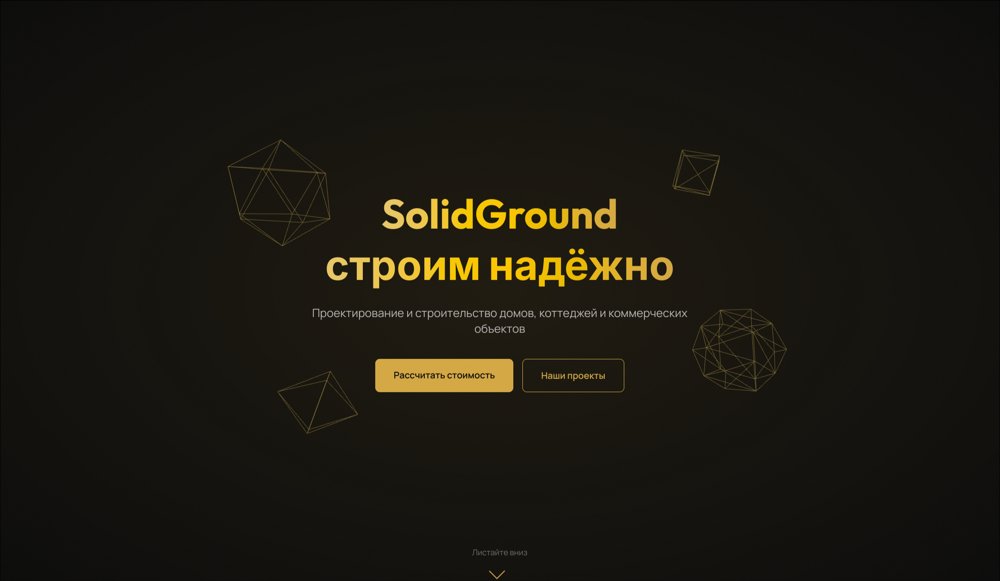

# solid-ground



> [Live Demo](https://solid-ground-eight.vercel.app/)

## О проекте

Одностраничный сайт-лендинг для строительной компании «SolidGround». Тёмная тема, золотые акценты, 3D-сцена в hero, интерактивная карта регионов работы.

## Технологии

- **Next.js 16** (App Router, статический экспорт)
- **TypeScript** (strict mode)
- **Tailwind CSS v4** (`@import "tailwindcss"`)
- **Framer Motion** — анимации по скроллу
- **Three.js + @react-three/fiber** — 3D-фигуры в hero
- **Lenis** — плавный скролл
- **Leaflet + react-leaflet** — интерактивная карта (CartoDB dark tiles)

## Структура

```
solid-ground/
├── app/
│   ├── api/
│   │   └── send/
│   │       └── route.ts
│   ├── globals.css
│   ├── layout.tsx
│   └── page.tsx
├── components/
│   ├── AboutSection.tsx
│   ├── AnchorHandler.tsx
│   ├── CalculatorSection.tsx
│   ├── ContactSection.tsx
│   ├── Counter.tsx
│   ├── CustomCursor.tsx
│   ├── FloatingShape.tsx
│   ├── Footer.tsx
│   ├── HeroSection.tsx
│   ├── LenisProvider.tsx
│   ├── MapContent.tsx
│   ├── MapSection.tsx
│   ├── Modal.tsx
│   ├── PortfolioSection.tsx
│   ├── PrivacyPolicyContent.tsx
│   ├── ReviewsSection.tsx
│   ├── Scene3D.tsx
│   ├── ScrollProgressBar.tsx
│   ├── ServicesSection.tsx
│   └── TimelineSection.tsx
├── public/
│   ├── favicon.svg
│   └── noise.svg
├── eslint.config.mjs
├── next.config.ts
├── package.json
├── package-lock.json
├── postcss.config.mjs
├── preview.png
└── tsconfig.json
```

## Секции

| # | Секция | Описание |
|---|--------|----------|
| 1 | Hero | 3D-сцена (икосаэдр, додекаэдр, октаэдр, куб) с плавающей анимацией |
| 2 | Услуги | Карточки с иконками, ценами |
| 3 | О компании | История, цифры (Counter), модальное окно с полным текстом |
| 4 | Портфолио | Галерея проектов с фильтрацией и модальным просмотром |
| 5 | Как мы работаем | Таймлайн 6 этапов с шахматным расположением |
| 6 | Отзывы | Карусель с автопрокруткой |
| 7 | Калькулятор | 4-шаговый расчёт стоимости, анимация итоговой цены |
| 8 | Карта | Интерактивная карта (Leaflet), 8 городов, полёт к региону |
| 9 | Контакты | Форма обратной связи, соцсети |
| 10 | Footer | Навигация, политика конфиденциальности |

## Особенности

- Кастомный курсор (кольцо + точка) на десктопе
- Плавный скролл (Lenis + Framer Motion RAF)
- Индикатор прогресса чтения
- Анимация чисел (Counter) при входе в область видимости
- Адаптив (mobile-first): 3 позиции для 3D-фигур (десктоп / планшет / мобилка)
- Карта: Ctrl+колёсико для зума, кнопки городов для навигации
- Все тексты на русском, жёстко закодированы (без CMS)
- Заявки из формы обратной связи приходят в Telegram (бот `@FormValidation_xyjear_bot`)
- Политика конфиденциальности с согласием на обработку ПДн

## Переменные окружения

При деплое на Vercel необходимо добавить:

| Переменная | Значение |
|-----------|----------|
| `BOT_TOKEN` | Токен Telegram-бота |
| `CHAT_ID` | ID чата для уведомлений |

## Разработка

```bash
npm install
npm run dev
```

Сборка:

```bash
npm run build
```

## Изображения

Плейсхолдеры проектов — [picsum.photos](https://picsum.photos).

## Лицензия

[MIT](LICENSE)
